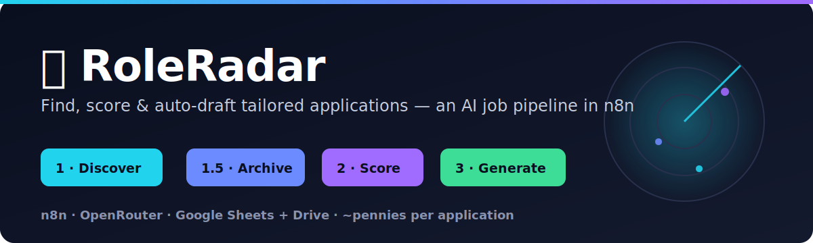
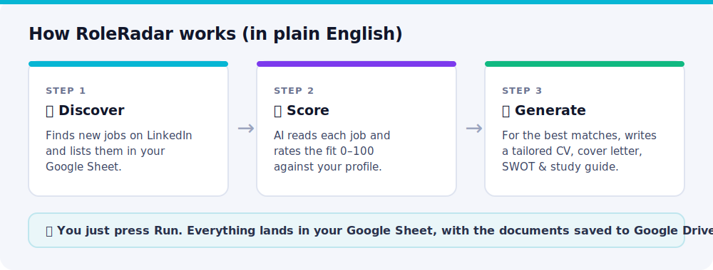
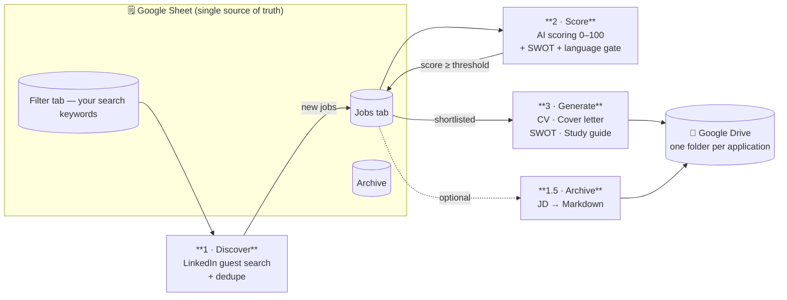
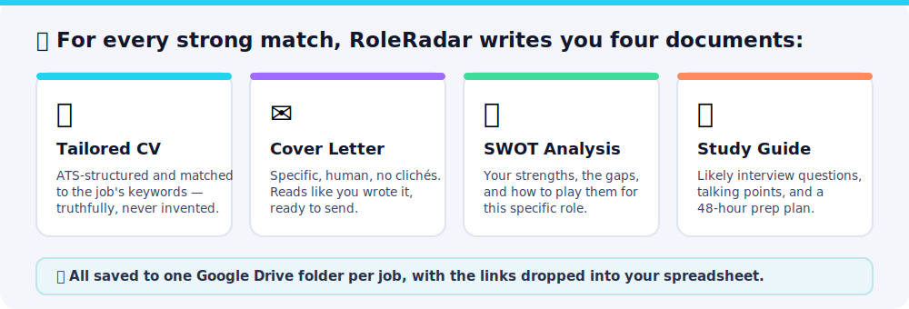

<!-- markdownlint-disable MD033 MD041 -->

  

<h1 align="center">📡 RoleRadar</h1>

  <b>Your AI job-application assistant.</b> Tell it what you do once — it finds matching jobs, 
  scores how well each fits, and writes you a tailored CV, cover letter and interview prep for every good one.

  
  
  
  
  

  <b>⭐ If RoleRadar saves you a weekend of copy-pasting cover letters, star it — it really helps.</b>

> **In plain English:** Job hunting is repetitive — find roles, read each one, judge the fit, then rewrite your
> CV and cover letter every single time. RoleRadar does that busywork for you and hands back ready-to-review
> documents, for a few cents each. **No coding. The only thing you install is [n8n](https://n8n.io)** (a free app
> that runs the automation). It works for **any job** — engineer, lawyer, chef, nurse, marketer, designer.

---

## 🧭 What it does

1. **Discover** — searches LinkedIn for jobs matching your keywords and lists them in a Google Sheet.
2. **Score** — an AI reads each job and rates the fit **0–100** against *your* profile, and explains why.
3. **Generate** — for the strong matches, it writes your application documents and saves them to Google Drive.

<b>See the detailed pipeline diagram</b>

## 🎁 What you get

Every document is **tailored to that specific job** using your real experience — and written to read like a
person wrote it, not an AI (no robotic clichés, no invented numbers, no em-dash giveaways).

<b>📄 See a sample (cover-letter excerpt)</b>

> Dear Hiring Manager,
>
> Nimbus's move to detection-as-code is exactly the problem I spent the last four years on at a Berlin scale-up.
> We ran security monitoring across AWS, Azure and GCP, and I rebuilt our alerting so every rule lived in Git
> with peer review and rollback, not in someone's console. The hardest part wasn't technical. It was convincing
> engineers that security automation deserves the same testing as the product itself.
>
> *(…)*
>
> Sincerely,
> Alex Mercer

*Generated from the bundled fictional sample profile. Your real profile produces your real letter.*

## 🌍 Works for any job

RoleRadar isn't just for tech. The scoring and the documents adapt to **whatever profile you give it**, so an
architect, a lawyer and a chef all get a fair score and a CV in their own field. The bundled example is a
security engineer — swap in your own details in one config box and you're set.

➡️ **[Ready-to-adapt example profiles](docs/EXAMPLE_PROFILES.md)** for a lawyer, chef, designer and nurse.

## 🚀 Get started

You only need three free-to-start accounts and about **30 minutes, once**:

| You need | Why | Cost |
|----------|-----|------|
| **[n8n](https://n8n.io)** | Runs the workflows (free Cloud trial = nothing to install) | Free to start |
| **Google** | Stores jobs (Sheet) + documents (Drive) | Free |
| **[OpenRouter](https://openrouter.ai)** | The AI that scores and writes | A few $/month, pay-as-you-go |

Then:

1. **Import** the four files in [`workflows/`](workflows) into n8n.
2. **Connect** your Google account and paste your OpenRouter key (one-time, stored safely in n8n).
3. **Copy** the [Google Sheet template](docs/GOOGLE_SHEET_TEMPLATE.md) and paste your profile into the config box.
4. **Press Run.** Watch jobs, scores and document links fill up your sheet.

📖 **First time? Start with the [⚡ Quick Start](docs/QUICKSTART.md)** (fastest path, ~30 min) — or the full
[step-by-step setup guide](docs/SETUP.md), which explains every term as it comes up, no background assumed.

## ✨ Why RoleRadar (not just another template)

Most "automate your job search" templates stop at *search → spreadsheet → one generic cover letter*. RoleRadar
is built to actually help you get interviews:

- 🎯 **Explainable scoring** — a clear 0–100 rubric (skills, seniority, location, pay, company), not a vibe, with
  the reasoning written back to your sheet so you know *why* a job fits.
- 🧬 **Truthful, tailored writing** — it mirrors the job's real keywords using *your* actual skills, and is
  forbidden from inventing facts or numbers. 15 ATS-safe CV layouts to pick from (or `auto`).
- 🕵️ **Won't out you as "AI-written"** — anti-cliché rules, varied rhythm, no em-dash tells, and it never leaves
  meta-notes in your CV.
- 🌍 **Configurable language gate** — only see jobs you can actually do (English-only by default).
- 🩹 **Built to not break** — retries, hardened parsing, and a visible `Needs Review` flag instead of silent
  failures or junk files.
- 🔐 **Secrets done right** — your API key lives in n8n's encrypted store, never in the files you share.

## 💸 Cost

The default models cost roughly **a few cents per full application** (scoring a job is a fraction of a cent).
Most people spend a couple of dollars a month. Full breakdown + cheaper presets in the
**[models & cost guide](docs/LLM_GUIDE.md)**.

## ⚙️ What you can configure

Everything you tune lives in the first **config box** of each workflow — no code:

| Setting | What it controls |
|---------|------------------|
| Your **profile + skills** | Who the CVs and cover letters are written for (swap out the sample) |
| **Searches** (`Filter` tab) | Which jobs to look for — one row per search |
| **`SCORE_THRESHOLD`** | How good a match has to be to get documents (default 65) |
| **`LANGUAGE_GATE`** | Skip jobs requiring a language you don't speak (English-only by default) |
| **`CV_TEMPLATE`** | Which of 15 ATS CV layouts (or `auto`) — see [CVs & cover letters](docs/CV_AND_COVER_LETTERS.md) |
| **Models** | Swap the AI models in one place — see [models & cost](docs/LLM_GUIDE.md) |

## 📚 Documentation

| Guide | For |
|-------|-----|
| **[⚡ Quick Start](docs/QUICKSTART.md)** | The fastest path to your first tailored CV (~30 min) |
| **[Setup guide](docs/SETUP.md)** | The detailed walk-through, every term explained |
| **[Credentials & Google access](docs/CREDENTIALS.md)** | Connecting Google (Cloud vs self-hosted) + OpenRouter |
| **[Skills, CVs & cover letters](docs/CV_AND_COVER_LETTERS.md)** | How tailoring works + the 15 ATS templates |
| **[Choosing AI models & costs](docs/LLM_GUIDE.md)** | Which model to use, pros/cons, price per job |
| **[Example profiles](docs/EXAMPLE_PROFILES.md)** | Adapt it to any field |
| **[Google Sheet template](docs/GOOGLE_SHEET_TEMPLATE.md)** | The tabs and columns to create |
| **[Architecture](docs/ARCHITECTURE.md)** · **[Rebuild from scratch](docs/REBUILD.md)** | How it all fits together |

## ⚖️ Legal & responsible use

RoleRadar reads LinkedIn's **public** job pages, which **may conflict with LinkedIn's Terms of Service** — use it
for personal, low-volume searching at your own risk and keep the built-in delays. Job posts can contain other
people's data, and your profile + the job text are sent to your chosen AI provider, so pick one you trust.
RoleRadar **does not apply to jobs for you** — it drafts documents that *you* review and send. None of this is
legal advice. See **[SECURITY.md](SECURITY.md)** for handling keys safely.

## ⚠️ Known limitations

- **LinkedIn parsing is best-effort** — if LinkedIn changes its pages, Discover may return few/zero jobs until
  the parser is updated.
- **AI model names change** — if you see lots of `Needs Review`, update the model name from
  [openrouter.ai/models](https://openrouter.ai/models) (one edit, no code).
- **Documents are Markdown** — open in Google Docs/Word and export to PDF/DOCX before submitting.

## 💬 Feedback & License

Shared as-is, as a personal project — no active roadmap, but **open an issue** if you hit a bug or have an idea.
Licensed [MIT](LICENSE) (do what you like, no warranty). Built with [n8n](https://n8n.io) and
[OpenRouter](https://openrouter.ai).

---

Not affiliated with LinkedIn. Respect each site's Terms of Service and use responsibly.

