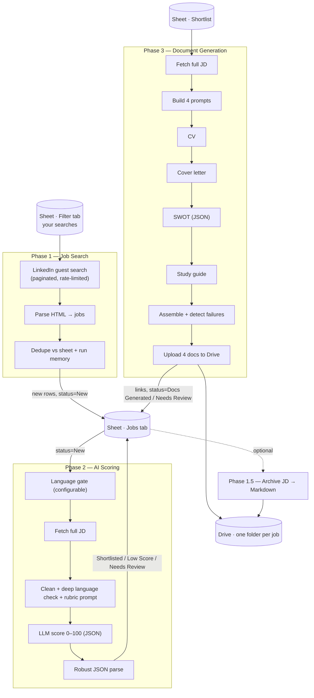

# Architecture

A single **Google Sheet** is the source of truth; **Google Drive** holds generated documents; **n8n** moves and
transforms the data; **OpenRouter** provides the LLMs.



## Data stores

### Google Sheet tabs
- **`Jobs`** — the master table. Every column the AI fills (score, SWOT, links, status, …) lives here.
- **`Filter`** — your search definitions; Phase 1 loops over each row. Columns: `Keyword`, `Location`,
  `Experience Level`, `Remote`, `Job Type`, `Easy Apply`.
- **`Shortlist`** — what Phase 3 reads. Either repoint Phase 3 to `Jobs` or back this tab with a `QUERY`
  (see [SETUP](SETUP.md#shortlist-tab)).
- **`Archieve`** — Phase 1.5's index of archived job descriptions.

### Google Drive
- **Applications/** — Phase 3 makes `YYYY-MM-DD__Company__Role__ScoreNN/` sub-folders, each with CV, cover
  letter, SWOT and study-guide files.
- **_archive/** — Phase 1.5's Markdown job descriptions.

## Job lifecycle (the `status` column)

```
New ──Phase 2──▶ Shortlisted ──Phase 3──▶ Docs Generated
        │                          │
        ├─▶ Low Score              └─▶ Needs Review   (generation failed — re-run)
        ├─▶ Rejected - Language Requirement
        └─▶ Needs Review           (scoring failed — re-run)
```

## Reliability design

- **Dedupe** uses both the spreadsheet snapshot and per-run static memory, keyed on `job_id`, `job_url`, and a
  `title|company|id` dedup key.
- **Rate limiting** via `Wait` nodes between LinkedIn fetches — don't remove these.
- **Hardened parsing** on every LLM-JSON boundary (Phase 2 score, Phase 3 SWOT): fence/`<think>` stripping,
  outermost-object extraction, retries, and a visible `Needs Review` status instead of silent failure.
- **Failure isolation:** HTTP nodes use `retryOnFail` + `onError: continueRegularOutput` so one bad job doesn't
  abort the whole batch.

## Conventions

- Nodes are prefixed by phase (`P1:`, `P1.5:`, `P2:`, `P3:`) and documented with sticky notes on the canvas.
- All secrets are credential references; all tunables live in the first `Set`/config node.
