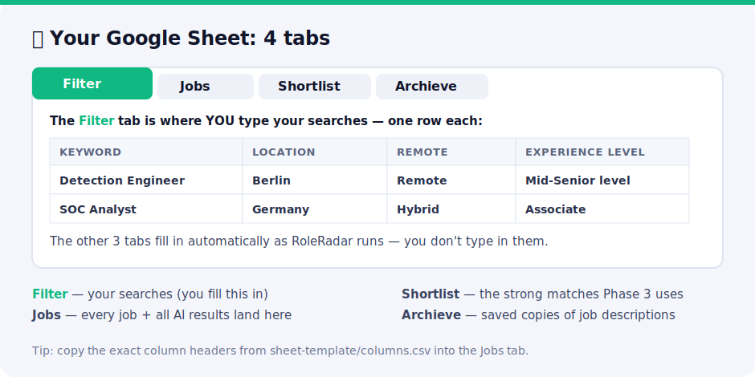
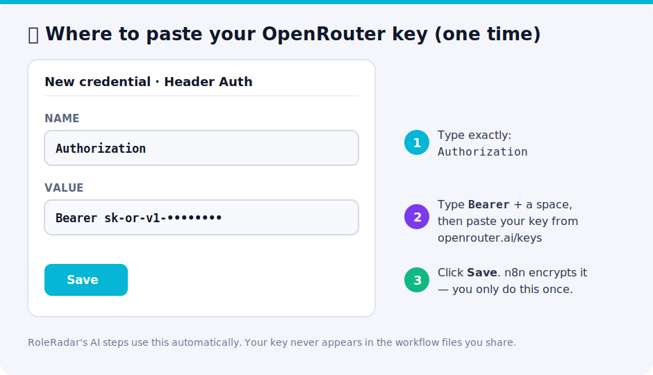

# Setup Guide

From zero to your first auto-generated CV in about 30 minutes. **No coding needed** — you'll do some one-time
clicking, then press **Run**. Every term is explained as it comes up.

> **Words you'll see (quick glossary):**
> - **n8n** — the free app that runs the workflows (think: a visual flowchart that actually *does* things).
> - **Workflow** — one of RoleRadar's 4 files you import (Discover, Archive, Score, Generate).
> - **Node** — a single step (box) inside a workflow.
> - **Credential** — where n8n safely stores a login or key, so you enter it only once.
> - **API key** — a password-like code that lets RoleRadar use a paid service (here, OpenRouter for the AI).
> - **Slug** — the short name of an AI model, e.g. `deepseek/deepseek-v4-flash`.

## 0. What you'll need

- An **n8n** account — the free **[Cloud trial](https://n8n.io)** is easiest (nothing to install); self-hosting also works.
- A **Google account** (for Google Sheets + Drive).
- An **OpenRouter** account + API key — <https://openrouter.ai/keys> (this is the only paid part; a few $/month).

## 1. Create the Google Sheet

Create one Google Sheet with **four tabs**. Exact columns are in
[GOOGLE_SHEET_TEMPLATE.md](GOOGLE_SHEET_TEMPLATE.md); the headers for the main `Jobs` tab are also in
[`sheet-template/columns.csv`](../sheet-template/columns.csv).

| Tab | Purpose |
|-----|---------|
| `Jobs` | Main table — every job and all AI output lands here. |
| `Filter` | **Your searches** — one row per keyword/location/filter combination. |
| `Archieve` | Job-description archive index (Phase 1.5). *(Yes, spelled this way to match the node.)* |
| `Shortlist` | Source for Phase 3 — see [the note below](#shortlist-tab). |

Copy the Sheet's ID from its URL (`https://docs.google.com/spreadsheets/d/`**`THIS_PART`**`/edit`).



## 2. Create the Drive folders

In Google Drive create two folders and copy each folder's ID from its URL:

- **Applications** — Phase 3 creates one sub-folder per job here.
- **_archive** — Phase 1.5 stores job-description Markdown here.

## 3. Add credentials in n8n

Create these once; every workflow references them by name.

| Credential | Type | Notes |
|------------|------|-------|
| **Google Sheets account** | Google Sheets OAuth2 | Standard Google OAuth flow. |
| **Google Drive account** | Google Drive OAuth2 | Standard Google OAuth flow. |
| **OpenRouter API** | **HTTP Header Auth** | `Name` = `Authorization`, `Value` = `Bearer sk-or-…` |

> 🔐 The OpenRouter key lives **only** in this credential — never in a node. That's why the workflow files in
> this repo are safe to share.



## 4. Import the workflows

In n8n: **Import from File** → select each file in [`workflows/`](../workflows):

1. `1-job-search.json`
2. `1.5-job-archive.json`
3. `2-ai-scoring.json`
4. `3-cv-coverletter-generator.json`

After import, open each workflow and make sure the Google/OpenRouter nodes show your credentials (re-select if
n8n shows "credential not found").

## 5. Configure the `Set` / config node in each workflow

Each workflow starts with a config node. Replace the placeholders:

- `GOOGLE_SHEET_ID` → your Sheet ID
- `DRIVE_ROOT_FOLDER_ID`, Applications/Archive folder IDs → your folder IDs
- **Phase 2** – replace the fictional **Alex Mercer** in `Set Candidate Profile` with your real profile,
  and set `SCORE_THRESHOLD` (default `65`).
- **Phase 3** – replace `FULL_CV_CONTEXT` and the `CANDIDATE_*` fields with your details, add your **`SKILLS`**
  (skillset), and pick a **`CV_TEMPLATE`** (`auto`, or `1`–`15`) — see [CVs & cover letters](CV_AND_COVER_LETTERS.md).
- Confirm the model slugs (`SCORING_MODEL`, `CV_MODEL`, …) against
  [MODELS_AND_COST.md](MODELS_AND_COST.md) and <https://openrouter.ai/models>.
- **Phase 2** – set the [language gate](#-language-gate) (`LANGUAGE_GATE`, `EXCLUDE_LANGUAGES`). Default is English-only.

> **Example — pick your CV template:** in Phase 3's `Set Job ID` node, set `CV_TEMPLATE` to:
> - `auto` *(default)* — RoleRadar picks the best layout per job (e.g. engineer → Technical, senior → Leadership).
> - a number `1`–`15`, or a name like `Technical / Engineering` — to force one style for every application.
>
> The template actually used is written to the `cv_template` column of your sheet, so you can see it per job.
> Full list & guidance: [CVs & cover letters](CV_AND_COVER_LETTERS.md).

## 6. Add your searches

In the `Filter` tab, add one row per search. Columns:

| Keyword | Location | Experience Level | Remote | Job Type | Easy Apply |
|---------|----------|------------------|--------|----------|------------|
| Detection Engineer | Berlin | Mid-Senior level | Remote | Full-time | |
| SOC Engineer | Germany | Associate,Mid-Senior level | Hybrid | | |

(Multiple values are comma-separated. Blank = no filter.)

## <a id="-language-gate"></a>🌍 Language gate (only see jobs you can actually do)

Phase 2 can automatically drop roles that require a language you don't speak. It's driven by two fields in the
**Phase 2 `Load Config`** node:

| `LANGUAGE_GATE` | Behavior |
|-----------------|----------|
| `off` | No language filtering — score every job. |
| `english_only` *(default)* | Drop jobs that **require** fluency in a common non-English language (German, French, Spanish, Italian, Dutch, Portuguese, Polish). |
| `exclude` | Drop only jobs requiring a language you list in `EXCLUDE_LANGUAGES` (comma-separated, e.g. `German,French`). |

Notes:
- A language listed only as "nice to have" / "a plus" isn't rejected — it applies a small score penalty instead.
- To **only see English roles**, keep the default `english_only`.
- To **allow a language you speak** (say German), set `LANGUAGE_GATE = exclude` with `EXCLUDE_LANGUAGES` blank
  (or omit that language from the list).
- Need a language that isn't built in? Add a pack to `LANG_PACKS` in the `P2: Extract & Clean Job Text` node.

## 7. Run it

Run them in order, each via its manual trigger:

1. **Phase 1** — populates `Jobs` with `status = New`.
2. **Phase 2** — scores the `New` jobs; good ones become `Shortlisted`.
3. **Phase 3** — generates CV / cover letter / SWOT / study guide for strong matches into Drive.

`Phase 1.5` (archive) is optional and can run any time after Phase 1.

## <a id="shortlist-tab"></a>⚠️ The `Shortlist` tab (one decision to make)

Phase 2 writes shortlisted jobs to the **`Jobs`** tab (`status = Shortlisted`), but Phase 3 reads a tab named
**`Shortlist`**. Pick one:

- **Simplest:** open Phase 3 → `P3: Load Jobs From Shortlist` and change the sheet name from `Shortlist` to
  `Jobs`. The node already filters by `recommendation`, so it'll just work.
- **Or** make `Shortlist` a live view of shortlisted rows with a QUERY in cell `A1`:
  ```
  =QUERY(Jobs!A:AK, "select * where M = 'Shortlisted'", 1)
  ```
  (Adjust the column letter if your `status` column isn't `M`.)

## Troubleshooting

| Symptom | Fix |
|--------|-----|
| Rows show `recommendation = Needs Review` | The LLM call failed or returned unparseable JSON — usually a **wrong model slug** or a temporary provider error. Check the model in the config node against <https://openrouter.ai/models>, then re-run. |
| Phase 1 returns 0 jobs | LinkedIn may be rate-limiting the guest endpoint. Wait, or increase the delay nodes. |
| `credential not found` after import | Re-select your credential in the affected node. |
| 401 from OpenRouter | The `OpenRouter API` Header Auth value must be `Bearer sk-or-…` (include the word `Bearer`). |
